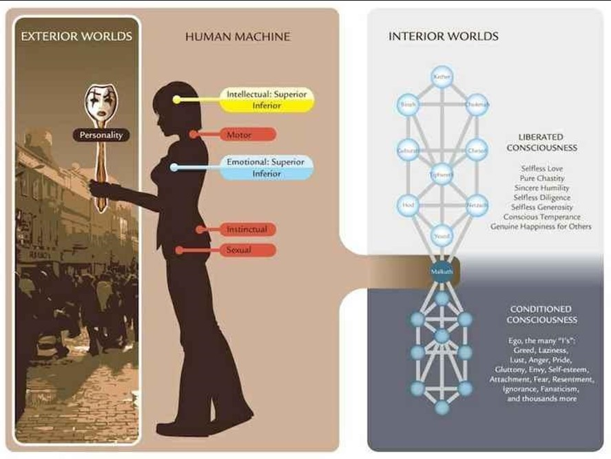

+++
title = "第四道相关"
date = "2026-09-29T19:52:28+08:00"
lastmod = "2026-09-29T19:52:28+08:00"
draft = false
tags = ["现代秘学研究"]
categories = ["神秘学"]
dropCap = false
comments = false
displayCopyright = false
related = false
share = false

+++

这张图片展示的正是**第四道（The Fourth Way）或诺斯底主义（Gnosticism）**心理学中关于“人类机器（Human Machine）”的核心教学图解。
该理论由神秘学大师乔治·葛吉夫（George Gurdjieff）提出，并由乌斯宾斯基（Ouspensky）等人发扬，后在当代诺斯底组织（如 Chicago Gnosis）的教学中与卡巴拉生命之树相结合。
图中的核心对应关系与第四道概念高度契合：
1. 人类机器与“五个中心”（Human Machine）
图片中女性剪影上标注的红、黄、蓝色块，正是第四道所说的三层大脑或五个中心：
• 理智中心（Intellectual Center）：图中大脑位置的黄圈，标注了高级与低级理智。
• 运动中心（Motor Center）与本能中心（Instinctual Center）：人体脊椎和中段的红圈。
• 情感中心（Emotional Center）：胸口位置的蓝圈，同样标注了高级与低级情感。
• 性中心（Sexual Center）：最下方的红圈。
第四道认为，尚未觉醒的普通人并没有真正独立的“自我”，只是一个受到外部刺激就会做出反射的“机器”，盲目地在这些中心之间消耗能量。
2. 人格（Personality）与伪装
左侧描绘了外部世界（Exterior Worlds），人手持一副小丑面具（Personality）。这对应第四道中“本质（Essence）与人格（Personality）”的区分：
• 人格是我们在社会中习得的虚假外壳、面具和防御机制。
• 机器化的人活着完全是由“人格”在主导，而真正的“本质”却在沉睡。
3. 内在世界与两种意识状态（Interior Worlds）
右侧将人的精神层次与卡巴拉生命之树（Tree of Life）相结合，展示了意识的两个极端：
• 被限制的意识（Conditioned Consciousness）：下方阴暗、倒置的树（通常指克里波特 Qliphoth 或潜意识深处）。这里充满了第四道所说的“许多个‘我’（The many 'I's'）”或自我（Ego），包含贪婪、懒惰、愤怒、傲慢等，使人处于沉睡状态。
• 被解放的意识（Liberated Consciousness）：上方明亮的生命之树，代表通过“自我观察”和“有意识的努力”后，有意识地转化性能量（Malkuth / Yesod 转化），最终走向无私的爱、纯洁与觉醒状态 。
https://www.pinterest.com/robapathy86/mysticism/
https://www.instagram.com/p/DZz4oehDSqB/
https://chicagognosis.org/lectures/category/sufi-path-of-self-knowledge
https://en.wikipedia.org/wiki/Human%E2%80%93machine_system
https://www.sciencedirect.com/topics/computer-science/human-machine-system
